# Отчет по лабораторной работе: GPU-кластер Kubernetes

## 1. Параметры VM и GPU

| Параметр | Значение |
|----------|----------|
| ОС | Ubuntu 22.04.5 LTS |
| Ядро | 5.15.0-157-generic |
| CPU | 8 vCPU |
| RAM | около 32 GiB |
| GPU | NVIDIA Tesla T4, 15360 MiB VRAM |
| Kubernetes | v1.34.8 |
| containerd | v2.2.1 |
| GPU Operator | v25.10.1 |
| NVIDIA Driver | 580.105.08 |
| CUDA в nvidia-smi | 13.0 |
| CUDA runtime в образе PyTorch | 12.4 |

## 2. Состояние Kubernetes-кластера

### Узел Kubernetes

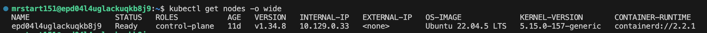

### Все pod в кластере

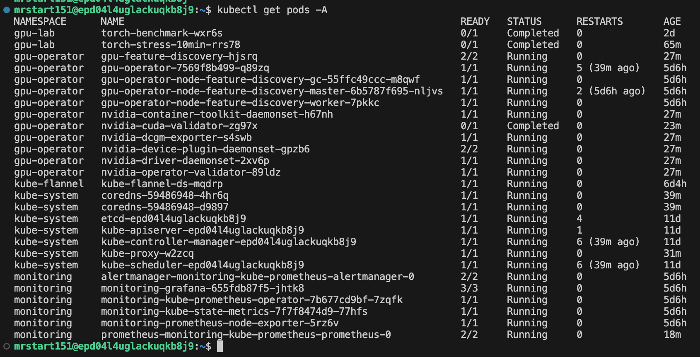

### GPU-ресурс на узле

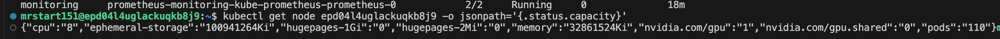

### Helm-релизы

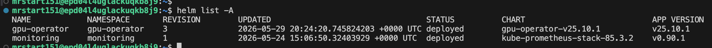

## 3. Проверка NVIDIA GPU внутри Kubernetes

### nvidia-smi из daemonset драйвера

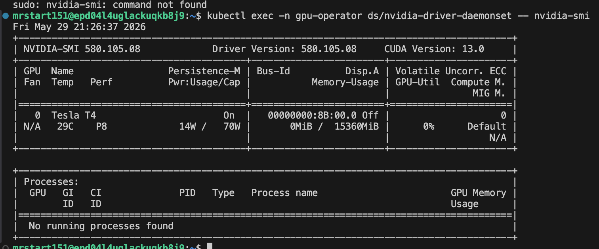

## 4. Проверка CUDA через JupyterLab

### CUDA в JupyterLab

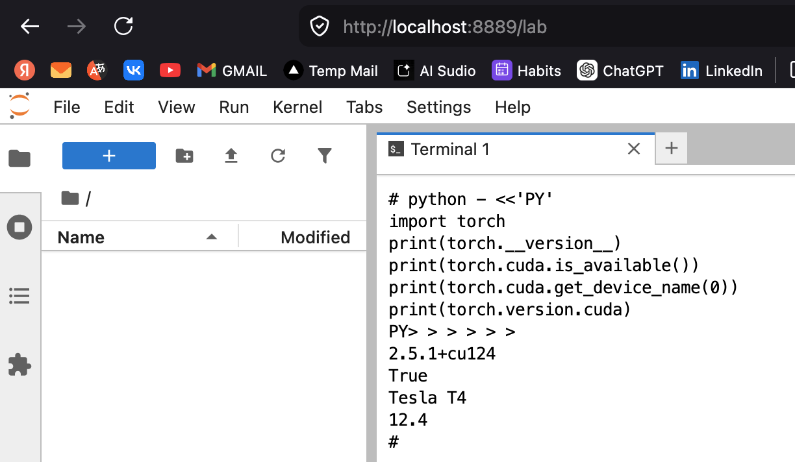

## 5. Эксперимент 1: Exclusive GPU

Конфигурация: один pod получает один физический GPU через ресурс nvidia.com/gpu: 1.

### Логи exclusive benchmark

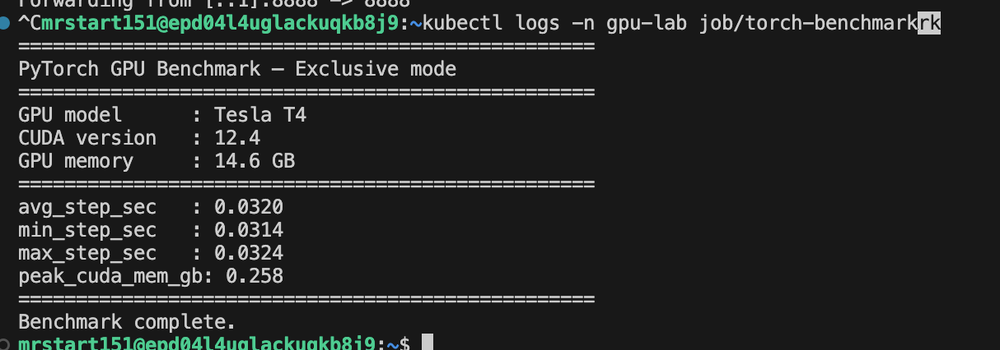

## 6. Эксперимент 2: Time-slicing

### Включение time-slicing

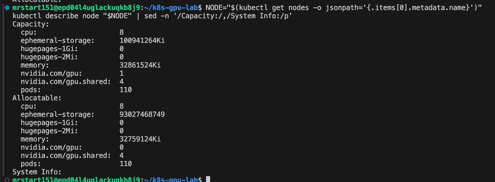

### Запуск четырех параллельных job

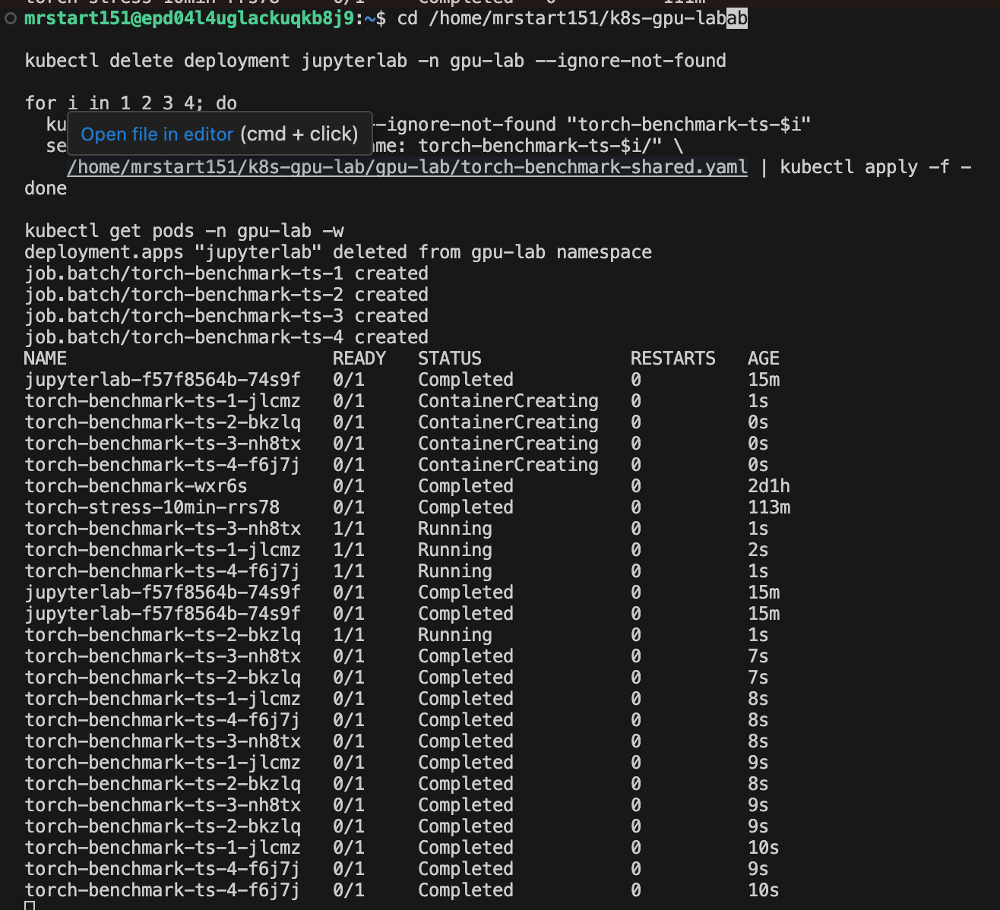

### Логи time-slicing benchmark

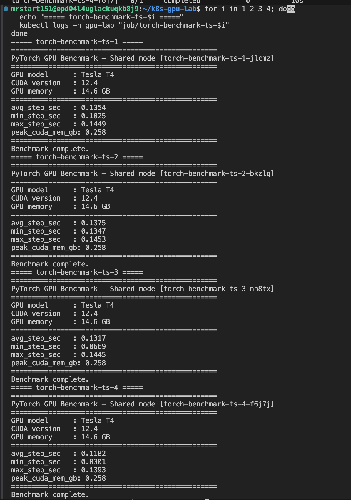

## 7. Эксперимент 3: MPS

MPS в NVIDIA Kubernetes device plugin имеет экспериментальный статус. В текущем окружении MPS не запустился: device plugin ожидал MPS daemon по /tmp/nvidia-mps, но контейнер драйвера не поднял daemon автоматически.

Фактическая ошибка: error waiting for MPS daemon: error checking MPS daemon health: failed to send command to MPS daemon: exit status 1.

### Логи MPS

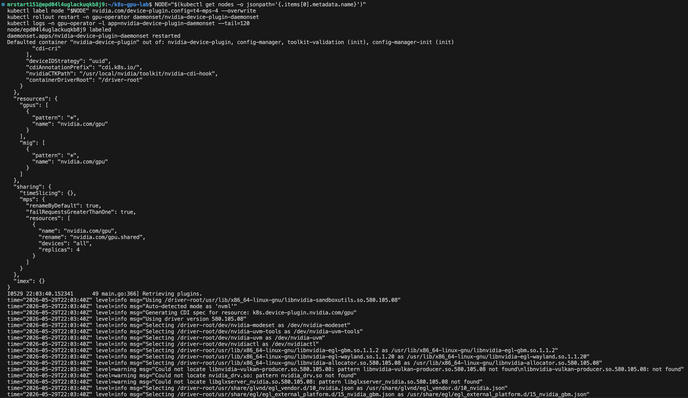

## 8. Мониторинг: DCGM, Prometheus, Grafana

### DCGM target в Prometheus

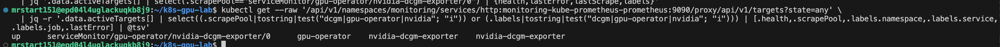

### GPU stress для сбора метрик

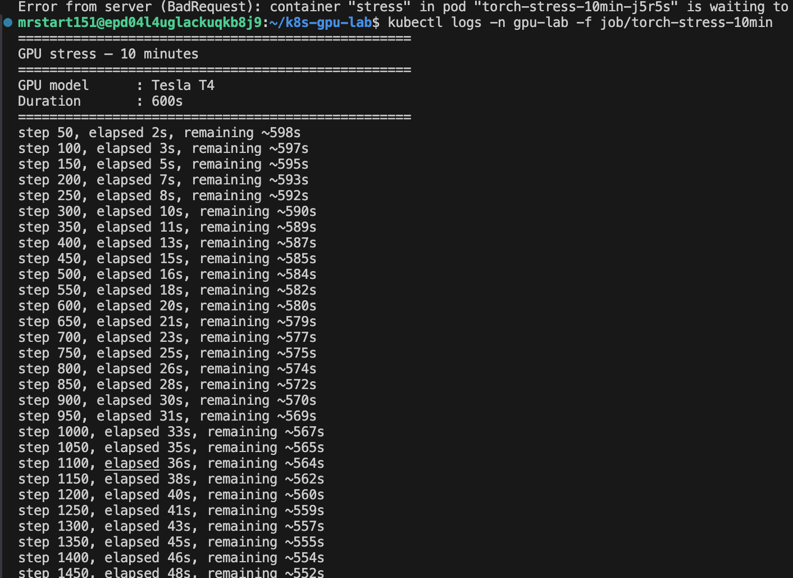

### Grafana: метрики GPU

Во время нагрузки torch-stress-10min в Grafana были видны основные метрики GPU:

| Метрика | Значение |
|---------|----------|
| GPU utilization | около 100% |
| FB used | около 328 MiB |
| Power usage | около 66-68 W |
| GPU temperature | около 66 C |
| Memory copy utilization | около 23-25% |

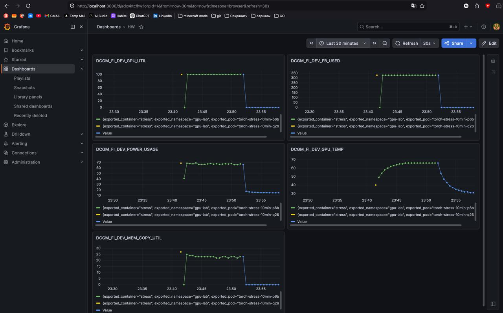

## 9. Сравнение режимов

| Режим | Число pod | Ресурс Kubernetes | avg_step_sec | Пик GPU util | Пик FB used | Комментарий |
|-------|-----------|---------------------|--------------|--------------|-------------|-------------|
| Exclusive | 1 | nvidia.com/gpu | 0.0320-0.0324 | до 100% на stress | 328 MiB на stress | Минимальная задержка, полный доступ к GPU |
| Time-slicing | 4 | nvidia.com/gpu.shared | около 0.133 | высокая суммарная загрузка при параллельных job | 4 x 0.258 GB CUDA-памяти | Задержка выросла примерно в 4 раза |
| MPS | не запустился | nvidia.com/gpu.shared | нет данных | нет данных | нет данных | MPS daemon отсутствует в текущей конфигурации контейнера драйвера |

## 10. Ответы на вопросы

**Почему в exclusive одна job обычно выполняется быстрее?**

В exclusive режиме pod получает физическую GPU полностью в свое распоряжение: нет конкуренции за SM, память и CUDA context. Поэтому задержка минимальная.

**Почему в time-slicing можно запустить несколько pod на одной GPU?**

NVIDIA device plugin с включенным timeSlicing публикует несколько логических ресурсов nvidia.com/gpu.shared поверх одной физической GPU. Kubernetes планирует pod как несколько GPU-слотов, а фактическое разделение выполняется через переключение CUDA context по времени.

**Какие риски появляются при разделении одной GPU между несколькими pod?**

- Нет жесткой аппаратной изоляции памяти.
- Один pod может занять слишком много GPU memory.
- Задержка становится менее предсказуемой.
- Одна шумная задача может ухудшить производительность соседних pod.

**Чем MPS отличается от time-slicing?**

Time-slicing переключает CUDA contexts целиком. MPS использует общий daemon-сервер, который принимает CUDA-команды от нескольких клиентов и отправляет их на GPU с меньшими накладными расходами. При этом изоляция все равно слабее, чем при выделенном GPU.

**Какой режим выбрать?**

- Одиночная тяжелая задача: exclusive.
- Несколько интерактивных JupyterLab или легких inference-сессий: time-slicing.
- Пакетный inference с высоким QPS: MPS, если окружение его поддерживает.

## 11. Бонус: Dynamic Resource Allocation (DRA)

### Исследование

По документации NVIDIA DRA Driver for GPUs нужны:

- Kubernetes v1.34.2+;
- GPU Operator v25.10.0+;
- NVIDIA driver 580+;
- CDI;
- отключенный NVIDIA device plugin для выделения GPU через DRA.

Текущий стенд подходит по версиям:

| Компонент | Версия |
|-----------|--------|
| Kubernetes | v1.34.8 |
| GPU Operator | v25.10.1 |
| NVIDIA Driver | 580.105.08 |
| DRA API | resource.k8s.io/v1 |
| NVIDIA DRA Helm chart | 25.12.0 |

### Ресурсы DRA API

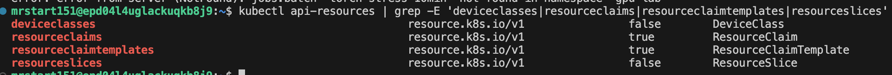

### NVIDIA DRA Helm chart

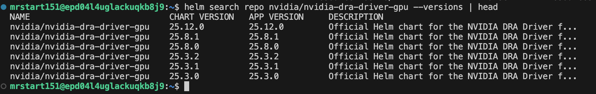

### Подготовленные DRA-манифесты

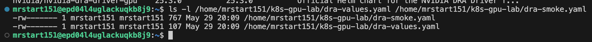

### Практическая попытка DRA

### Переключение GPU Operator для DRA

GPU Operator был переключен в режим с CDI и без NVIDIA device plugin. На выводе ниже видно, что cdi.enabled=true, cdi.default=true, devicePlugin.enabled=false, а версия драйвера осталась 580.105.08.

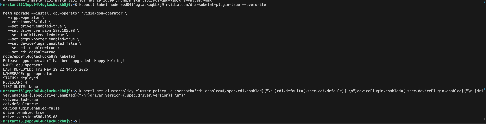

Проверка DRA была остановлена до установки nvidia-dra-driver-gpu: при переключении GPU Operator начал переустанавливать контейнер драйвера, а внутри pod не работал DNS через UDP service kube-dns.

Ключевые признаки ошибки:

- Temporary failure resolving 'archive.ubuntu.com';
- Could not resolve Linux kernel version;
- UDP-запросы напрямую к CoreDNS pod проходили;
- TCP-запросы к service IP kube-dns проходили;
- UDP-запросы к service IP kube-dns завершались timeout.

Для восстановления базовой лабораторной GPU Operator был возвращен в режим device plugin. CoreDNS upstream был исправлен на forward . 10.129.0.2; для daemonset драйвера временно включены hostNetwork=true и dnsPolicy=Default, чтобы контейнер драйвера использовал DNS хоста.

### Возврат к базовому режиму GPU Operator

После восстановления CDI отключен, NVIDIA device plugin снова включен, nvidia-driver-daemonset и nvidia-device-plugin-daemonset находятся в состоянии Running, а на узле снова доступен GPU-ресурс nvidia.com/gpu: 1.

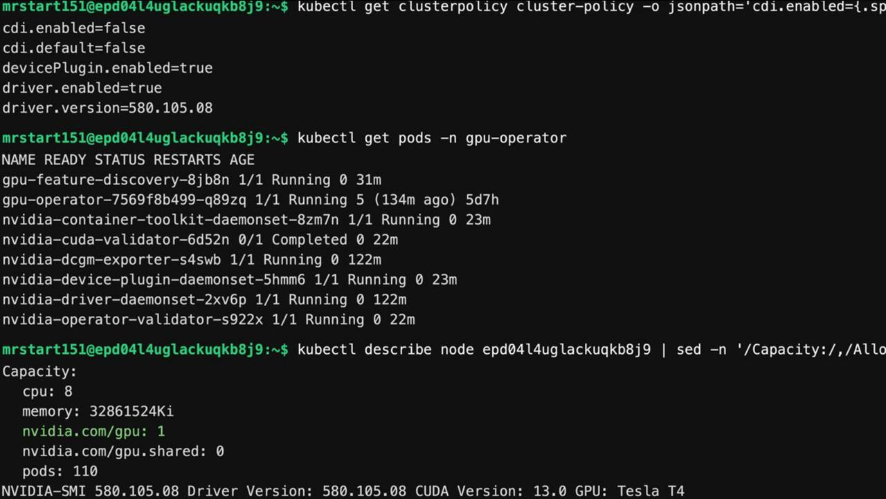

Источники:

- NVIDIA DRA Driver for GPUs: https://docs.nvidia.com/datacenter/cloud-native/gpu-operator/latest/dra-intro-install.html
- Kubernetes Dynamic Resource Allocation: https://v1-34.docs.kubernetes.io/docs/concepts/scheduling-eviction/dynamic-resource-allocation/

## 12. Бонус: одноузловой кластер Slurm

На той же VM был развернут одноузловой кластер Slurm.

### MUNGE

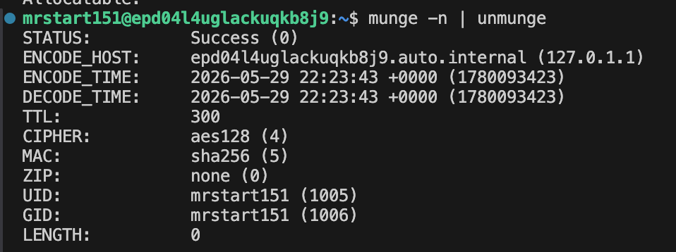

### Slurm partition

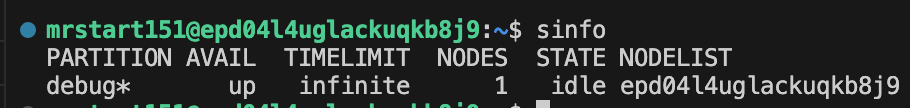

### Параметры узла Slurm

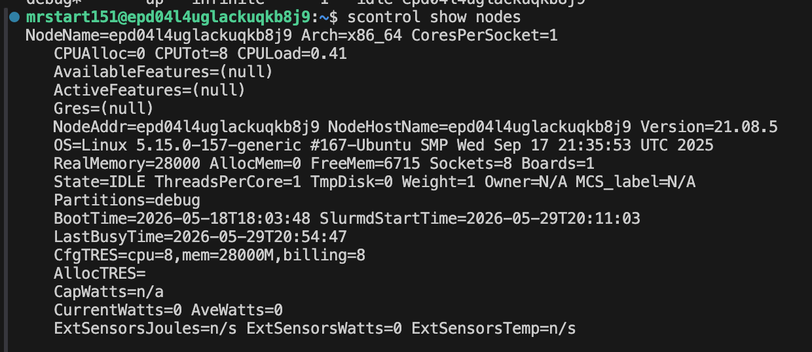

### Slurm srun

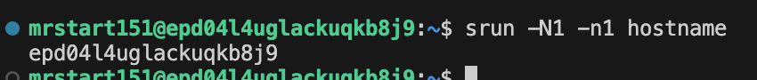

### Вывод batch-задачи Slurm

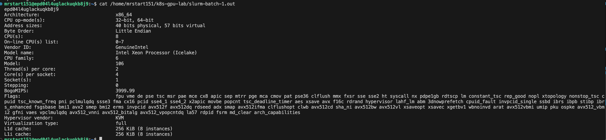

### Очередь Slurm

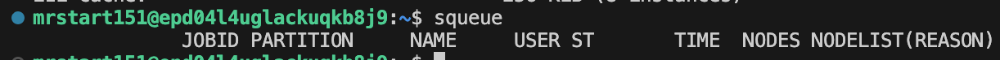

### Почему Slurm без GPU GRES

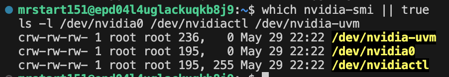

Вывод: GPU GRES в Slurm не включен. На host видны /dev/nvidia0, /dev/nvidiactl и /dev/nvidia-uvm, но host nvidia-smi/NVIDIA userspace не установлен, а распределением GPU управляет NVIDIA GPU Operator внутри Kubernetes. Для учебного одноузлового стенда безопаснее не смешивать Slurm GPU GRES с контролем Kubernetes над одной физической GPU; Slurm развернут как одноузловой CPU-кластер, а GPU используется через Kubernetes device plugin.

Источники:

- Slurm Quick Start Admin Guide: https://slurm.schedmd.com/quickstart_admin.html
- Slurm Quick Start User Guide: https://slurm.schedmd.com/quickstart.html
